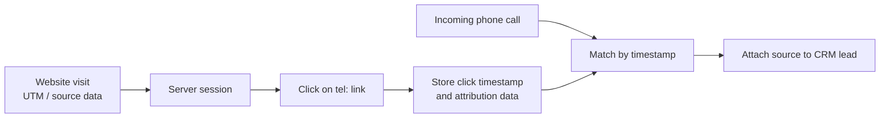

# Click-to-Call Attribution

A simple heuristic for associating incoming phone calls with website visitors without using dedicated call-tracking phone numbers.

I originally used this approach in web projects where marketing attribution data was available in the browser session, but customers could convert by calling the company instead of submitting a form.

## Problem

When a visitor submits a form on a website, attribution data such as UTM parameters, referrers and campaign information can be stored together with the lead.

Phone calls are different: the browser does not automatically pass website-session data to the phone system.

Traditional call tracking solves this by showing different phone numbers to different traffic sources or visitor sessions, but that requires additional phone numbers and infrastructure.

For lower-volume use cases, a simpler heuristic can work.

## Approach

The idea is to use the click on a `tel:` link as a bridge between the website session and the subsequent phone call.



The flow is:
1. Capture attribution data when the visitor arrives.
2. Store it in the user's server-side session.
3. Track clicks on the website's phone number.
4. Save the click timestamp together with the session attribution data.
5. When a call arrives from a previously unknown number, compare its timestamp with recent click events.
6. If a click happened within a small time window, associate the stored attribution data with the call.

## Capturing the traffic source

For a minimal example, a UTM source can be stored in the PHP session:

```php
session_start();

$utmSource = (string) @$_GET['utm_source'];

if ($utmSource) {
    $_SESSION['utm_source'] = $utmSource;
}
```

A real application would normally preserve more attribution data than a single UTM parameter.

## Tracking the phone click

The phone number is rendered as a regular `tel:` link:

```html
<a href="tel:+78121234567" class="telephone">
    +7 812 123-45-67
</a>
```

The click is also reported to the backend:

```javascript
$('.telephone').click(function () {
    $.post('/calltracking', {}, function (result) {
    }, 'json');
});
```

The `tel:` link continues to open the phone application normally.

## Storing the click event

The backend stores the time of the click and the attribution data associated with the current session:

```php
$DB->query("
    INSERT INTO ?_calltracking (
        `time`,
        `source`
    ) VALUES (
        NOW(),
        ?
    )
",
    $_SESSION['utm_source']
);
```

The example uses the database helper from this repository.

## Matching the call

The final step happens outside the website itself.

Incoming calls from new phone numbers are compared with recent click events. If a click occurred within an acceptable time window, for example, a few seconds before the call, the click and call can be treated as a likely match.

In a production system this step can be automated by integrating:
- the telephony provider or PBX API
- the stored click events
- the CRM system

The matched website attribution data can then be attached to the corresponding lead or customer record.

## Characteristics

This method is deliberately heuristic.

### Advantages

- No additional phone numbers are required
- Very little infrastructure is needed
- Quick to implement for low-volume websites
- The same idea can be applied to clicks on email addresses or messenger links

### Limitations

- It only works when the visitor clicks the phone number on the website
- It cannot attribute calls from visitors who manually dial the number
- Timestamp matching becomes unreliable when many calls and clicks happen close together
- The matching window introduces the possibility of incorrect attribution
- Production use may require appropriate privacy disclosures and compliance measures

It is therefore best suited to low-volume environments where a lightweight attribution signal is more valuable than perfect accuracy.

## Project status

Historical attribution technique used in web projects during the 2010s.

This directory documents the original approach rather than providing a complete call-tracking product.

## Author

Valery Kirkizh

[valery@kirkizh.com](mailto:valery@kirkizh.com)
